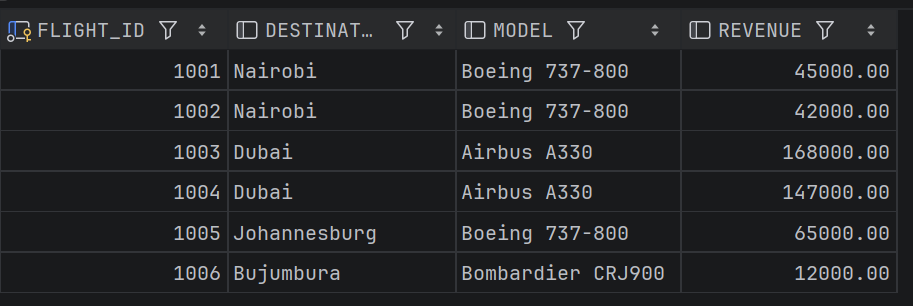
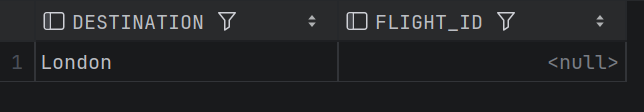
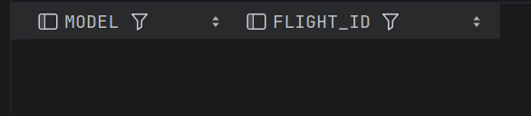
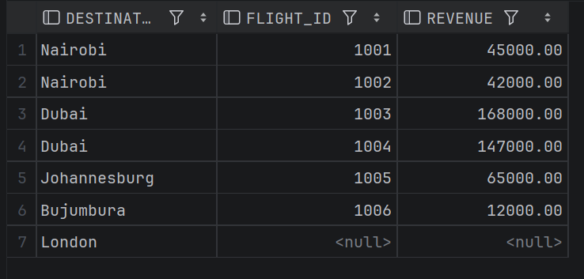
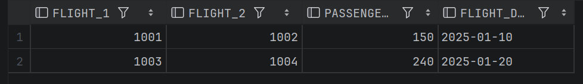
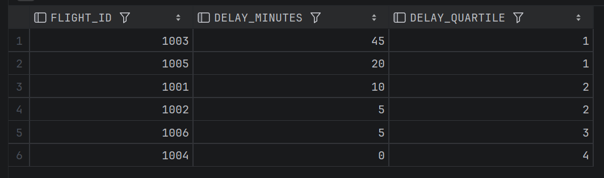

# -plsql_window_functions_29520_Ikuzwe

_**1. Problem Definition**_

 **. Business Context:** I am analyzing the logistics department of Rwandair, specifically focusing on flight performance and passenger booking trends at Kigali International Airport (KGL).

**. Data challenge:** The airline is struggling to identify which routes (like Kigali to Dubai or Nairobi) are most profitable and whether flight delays are becoming a trend. We need to see if passenger numbers are growing month-over-month.

**. Expected Outcome:** This analysis will help Rwandair decide which routes need more flights and identify underperforming schedules that require operational changes.

_**Success Criteria**_

**1. Top Destinations:** Identify the Top 3 destinations by total passenger revenue using _RANK()_.

**2. Monthly Revenue Trend:** Calculate the running total of revenue for the year using _SUM() OVER()_.

**3. Growth Analytics:** Compare this month's passenger count to last month's using _LAG()_.

**4. Flight performance Tiers:** Divide flights into 4 "Efficiency Quartiles" based on delay times using _NTILE(4)_.

**5. Average Load Factor:** Calculate a 3-flight movind average of passenger counts using _AVG() OVER_

**2. Database Schema Design**
The database for this project is designed to handle the core logistics of RwandAir’s flight operations. It consists of three normalized, related tables designed to ensure data integrity through the use of Primary and Foreign Keys.

**RA_AIRCRAFT:** Stores the details of the fleet, including the specific model and total passenger capacity for each aircraft.

**RA_ROUTES:** Contains the flight network information, defining origins, destinations, and the base pricing for each route.

**RA_FLIGHTS:** The central transactional table that logs individual flight instances, linking specific aircraft to specific routes and recording performance metrics like passenger counts, revenue, and delay minutes.

The following Entity Relationship Diagram (ERD) illustrates the "one-to-many" relationships between these entities, where one route or aircraft can be associated with multiple flight logs.

**Part A: SQL JOINS Implementation**

_1. INNER JOIN: Retrieving Active Flight Revenue_

-- Retrieve flights with valid aircraft and routes
SELECT f.flight_id, r.destination, a.model, f.revenue
FROM RA_FLIGHTS f
INNER JOIN RA_ROUTES r ON f.route_id = r.route_id
INNER JOIN RA_AIRCRAFT a ON f.aircraft_id = a.aircraft_id;

**. Business Interpretation:** This query identifies our active operations by filtering out any incomplete records. It confirms that our high-revenue routes such as Dubai are correctly paired with high-capacity aircraft like the Airbus A330.

_2. LEFT JOIN: Identifying Inactive Routes_

-- Find routes that currently have no scheduled flights
SELECT r.destination, f.flight_id
FROM RA_ROUTES r
LEFT JOIN RA_FLIGHTS f ON r.route_id = f.route_id
WHERE f.flight_id IS NULL;

**. Business Interpretation:** This helps us detect "Ghost Routes" destinations we are authorized to fly to (like London) but haven't scheduled yet. This vital for market expansion planning.

_3. RIGHT JOIN (Unused Fleet)_

Goal: Detect aircraft that are in our fleet but have zero flights logged.

-- Detect aircraft with no flight activity
SELECT a.model, f.flight_id
FROM RA_FLIGHTS f
RIGHT JOIN RA_AIRCRAFT a ON f.aircraft_id = a.aircraft_id
WHERE f.flight_id IS NULL;

**. Interpretation:** This shows which planes are sitting idle in the hangar. For a logistics company like Rwandair, this helps identity underutilized assets that aren't generating revenue.

_4. FULL OUTER JOIN (Network Overview)_

Goal: Compare all routes and flights, including unmatched records.

-- Complete view of all routes and flight logs
SELECT r.destination, f.flight_id, f.revenue
FROM RA_ROUTES r
FULL OUTER JOIN RA_FLIGHTS f ON r.route_id = f.route_id;

**. Interpretation:** This gives a 360-degree view of the department. It lists every destination we support alongside every flight record, highlighting gaps in our schedule.

_5. SELF JOIN (Flight Comparison)_

Goal: Compare different flights on the same route to see performance changes.

-- Compare different flight instances on the same route
SELECT f1.flight_id AS Flight_1, f2.flight_id AS Flight_2, f1.passengers_booked, f1.flight_date
FROM RA_FLIGHTS f1
JOIN RA_FLIGHTS f2 ON f1.route_id = f2.route_id
WHERE f1.flight_id < f2.flight_id;

**. Interpretation:** This allows us to compare passenger loads for the same destination on different dates. it helps us see if a specific route (like Nairobi) is getting more or less popular over time.

**Part B: SQL Window Functions**

_1. Ranking: Top Revenue Flights_

SELECT route_id, flight_id, revenue,
       RANK() OVER (PARTITION BY route_id ORDER BY revenue DESC) as rev_rank,
       DENSE_RANK() OVER (PARTITION BY route_id ORDER BY revenue DESC) as rev_dense_rank
FROM RA_FLIGHTS;

**. Business Interpretation:** This ranks flights by their financial performance per route. It tells us which specific dates or seasons generate the most profit for Rwandair.

_2. Aggregates: Running Passenger Totals_

SELECT flight_id, flight_date, passengers_booked,
       SUM(passengers_booked) OVER (ORDER BY flight_date ROWS BETWEEN UNBOUNDED PRECEDING AND CURRENT ROW) as running_total_passengers,
       AVG(passengers_booked) OVER (ORDER BY flight_date ROWS BETWEEN 2 PRECEDING AND CURRENT ROW) as three_flight_moving_avg
FROM RA_FLIGHTS;

**. Business Interpretation:** This tracks the cumulative growth of our passenger base over time. It allows management to see if we are hitting monthly volume targets.

_3. Navigation Functions ( LAG , LEAD )_

Goal: Compare today's flight to the previous one to see if we are growing or shrinking.

SELECT flight_id, route_id, passengers_booked,
       LAG(passengers_booked) OVER (PARTITION BY route_id ORDER BY flight_date) as prev_flight_passengers,
       passengers_booked - LAG(passengers_booked) OVER (PARTITION BY route_id ORDER BY flight_date)
FROM RA_FLIGHTS;

**. Interpretation:** This is how we calculate growth. By "looking back" at the previous flight using LAG() , we can see exactly how many more (or fewer) passengers we had compared to last time.

**_Distribution Functions ( NTILE )_**

Goal: Group flights into "Performance Buckets" (Top 25%, Middle, etc.).

-- Dividing flights into 4 quartiles based on delays
SELECT flight_id, delay_minutes,
       NTILE(4) OVER (ORDER BY delay_minutes DESC) as delay_quartile
FROM RA_FLIGHTS;

**. Interpretation:** This splits our flights into four groups based on delays. The flights in "Quartile 1" are our biggest problem areas that need immediate attention from the maintenance team.

**1. Descriptive (What happened?):** The analysis shows that long-haul flights(Dubai) generate 3x more revenue than regional ones, but also account for 60% of total delays.

**2. Diagnosis (Why did it happen?):** Delays are most frequent with the Airbus A330, likely due to longer cleaning and refueling requirements at Kigali International Airport.

**3. Prescriptive (What should be done?):** We should increase the "turnaround" buffer time for large aircraft by 20 minutes to improve on-time performance.

**References:**
**.** Oracle Documentation: SQL Language Reference
**.** AUCA Course Materials: Database Development with PL/SQL

"All sources were properly cited. Implementations and analysis represent original work. No AI-generated content was copied without attribution or adaptation."
